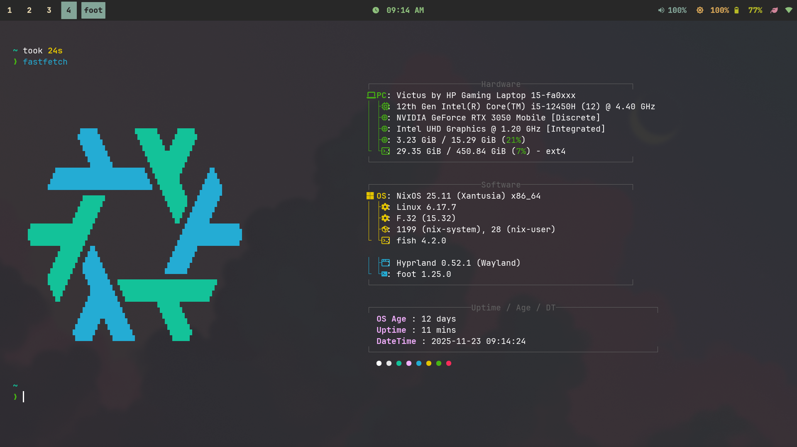

# NIXOS CONFIG
Just clone this repo in home directory and use 
```
sudo nixos-rebuild switch --flake ~/nix#The-Machine 
```

This will setup hyprland with ly and has scripts and dots will be auto managed by home-manager

afterwards to update the config , just use 
```
nix-switch
```
, it will cd in to ~/nix , commit to git with the tag of time and date 



